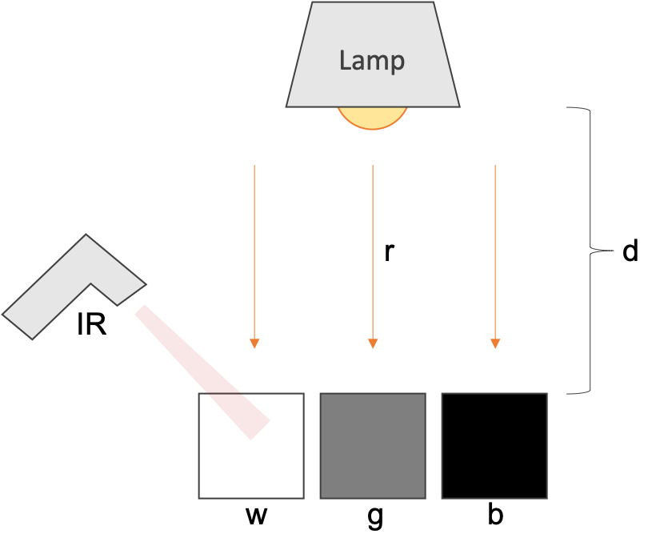

```{r, echo=FALSE,message=FALSE, warning=FALSE}
#this is global setup info for this document
knitr::opts_chunk$set(fig.align="center",message=FALSE, warning=FALSE)
library(knitr)
library(kableExtra)
library(tikzDevice)
```

## Introduction
This page describes visualization of temperature changes in felt samples held under an incandescent lamp. 

## Setup
Place three equally-sized squares of felt in three colors (white, grey, black) on a flat surface such as a table. Suspend a single incandescent bulb, preferably inside of a lamp housing, over the squares and turn on the power so an even light shines across the three samples. At regular time intervals (for example, every 30 seconds), measure and record the temperature (in Celcius) of each sample using a non-contact infrared thermometer. Continue data collection for a pre-determined amount of time, perhaps 10 minutes. It may be helpful to have a few helpers on hand: one to measure and call out values and one or more for recording temperature readings to paper. 

```{r echo=FALSE, fig.cap="Felt demonstration setup. An incandescent bulb shines light rays (r) from a lamp (lamp) onto three squares of felt (w, g, b). An infrared thermometer (IR) is used to read temperature data from each square of felt. Data are recorded for analysis as below.", out.width = '50%'}

```

## Data Collection
```{r, echo=FALSE}
feltW<-c(22.4,23.7,23.8,23.9,24.1,23.9,24.3,24.1,24.2,23.9,24.2) #temperature series of the white felt
feltG<-c(22.5,23.8,24.2,24.6,24.8,25.2,25.7,26.1,25.9,26.2,26.8) #temperature series of the grey felt
feltB<-c(22.3,24.1,24.7,25.4,25.9,26.5,27.3,28.5,28.9,29.3,30.4) #temperature series of the black felt
timeMin<-c(0,0.5,1.0,1.5,2.0,2.5,3.0,3.5,4.0,4.5,5.0) #time series in minutes
dt<-data.frame(timeMin,feltW,feltG,feltB)
```
Data should be collected and arranged in a notebook similar to the following table.

```{r, echo=FALSE,message=FALSE, warning=FALSE}
kable(dt) %>% kable_styling(full_width = F)
```

## Analysis Procedure

### Data Loading
First, we load in the temperature data for each felt square. W = white, G = Grey, B = Black. Temperatures are in Celsius. 
```{r}
feltW<-c(22.4,23.7,23.8,23.9,24.1,23.9,24.3,24.1,24.2,23.9,24.2) #temperature series of the white felt
feltG<-c(22.5,23.8,24.2,24.6,24.8,25.2,25.7,26.1,25.9,26.2,26.8) #temperature series of the grey felt
feltB<-c(22.3,24.1,24.7,25.4,25.9,26.5,27.3,28.5,28.9,29.3,30.4) #temperature series of the black felt
```

Next, we create a data vector for the time. Units are minutes. 
```{r}
timeMin<-c(0,0.5,1.0,1.5,2.0,2.5,3.0,3.5,4.0,4.5,5.0) #time series in minutes
```

### Exploratory Plots
Let's take a quick peek at the plot with each series to get some ideas for a nice visualization. Notice the minimum and maximum temperatures -- we'll use those to set limits for the Y axis later. Notice also that the data points will need to be styled somehow -- we'll want to choose something clean and simple that still represents the data well. 
```{r}
plot(timeMin,feltW)
plot(timeMin,feltG)
plot(timeMin,feltB)
```

### Creating a Nice Visualization
To create a nice visualization, we'll want to do a few things: represent all three series on the same plot, ensure each series is distinct, and add accurate labels to the axes. We'll also need a descriptive title and a legend to clarify what data we are representing. One last thing we will do is adjust our Y axis to start at zero. A little attention to detail and we'll be done with our enhanced view of our data.

First, we create a simple plot with the first series (white felt).
```{r}
#First plot layer
plot(timeMin,                                           #X axis data
     feltW,                                             #Y axis data
     pch=21,                                            #point character (circle with fill)
     col="darkgrey",                                    #point border color
     bg="white",                                        #point fill color 
     type="o",                                          #line graph style (line with data points) 
     lty=2,                                             #line graph style (dashed) 
     ylim=c(0,32),                                     #Y axis lower and upper limits
     ylab="Temperature (°C)",                           #Y axis label
     xlab="Time (minutes)",                             #X axis label 
     main="Comparison of Felt Temperatures over Time"   #Plot title
     )
```

Next, we add the second series (grey felt).
```{r}
#First plot layer
plot(timeMin,                                           #X axis data
     feltW,                                             #Y axis data
     pch=21,                                            #point character (circle with fill)
     col="darkgrey",                                    #point border color
     bg="white",                                        #point fill color 
     type="o",                                          #line graph style (line with data points) 
     lty=2,                                             #line graph style (dashed) 
     ylim=c(0,32),                                     #Y axis lower and upper limits
     ylab="Temperature (°C)",                           #Y axis label
     xlab="Time (minutes)",                             #X axis label 
     main="Comparison of Felt Temperatures over Time"   #Plot title
     )

#add another data series
points(timeMin,        #X axis data
       feltG,          #Y axis data
       pch=21,         #point character (circle with fill)
       col="darkgrey", #point border color
       bg="grey",      #point fill color 
       type="o",       #line graph style (line with data points)
       lty=2           #line graph style (dashed) 
       )
```

Next, we add the last series (black felt).
```{r}
#First plot layer
plot(timeMin,                                           #X axis data
     feltW,                                             #Y axis data
     pch=21,                                            #point character (circle with fill)
     col="darkgrey",                                    #point border color
     bg="white",                                        #point fill color 
     type="o",                                          #line graph style (line with data points) 
     lty=2,                                             #line graph style (dashed) 
     ylim=c(0,32),                                     #Y axis lower and upper limits
     ylab="Temperature (°C)",                           #Y axis label
     xlab="Time (minutes)",                             #X axis label 
     main="Comparison of Felt Temperatures over Time"   #Plot title
     )

#add another data series
points(timeMin,        #X axis data
       feltG,          #Y axis data
       pch=21,         #point character (circle with fill)
       col="darkgrey", #point border color
       bg="grey",      #point fill color 
       type="o",       #line graph style (line with data points)
       lty=2           #line graph style (dashed) 
       )

#add another data series
points(timeMin,        #X axis data
       feltB,          #Y axis data
       pch=21,         #point character (circle with fill)
       col="darkgrey", #point border color
       bg="black",     #point fill color 
       type="o",       #line graph style (line with data points)
       lty=2           #line graph style (dashed) 
       )
```

Then, we add some background lines to help us understand the data locations a bit better.
```{r}
#First plot layer
plot(timeMin,                                           #X axis data
     feltW,                                             #Y axis data
     pch=21,                                            #point character (circle with fill)
     col="darkgrey",                                    #point border color
     bg="white",                                        #point fill color 
     type="o",                                          #line graph style (line with data points) 
     lty=2,                                             #line graph style (dashed) 
     ylim=c(0,32),                                     #Y axis lower and upper limits
     ylab="Temperature (°C)",                           #Y axis label
     xlab="Time (minutes)",                             #X axis label 
     main="Comparison of Felt Temperatures over Time"   #Plot title
     )

#add another data series
points(timeMin,        #X axis data
       feltG,          #Y axis data
       pch=21,         #point character (circle with fill)
       col="darkgrey", #point border color
       bg="grey",      #point fill color 
       type="o",       #line graph style (line with data points)
       lty=2           #line graph style (dashed) 
       )

#add another data series
points(timeMin,        #X axis data
       feltB,          #Y axis data
       pch=21,         #point character (circle with fill)
       col="darkgrey", #point border color
       bg="black",     #point fill color 
       type="o",       #line graph style (line with data points)
       lty=2           #line graph style (dashed) 
       )

#add background lines for clarity in interpretation
abline(h=seq(0,32,by=2), #create a numeric sequence from 20 to 32 at each second value (20, 22, 24,..32)
       lty=3,             #line graph style (dashed, small)
       col="lightgrey"    #line color
       )
```

Finally, we add the legend.
```{r}
#First plot layer
plot(timeMin,                                           #X axis data
     feltW,                                             #Y axis data
     pch=21,                                            #point character (circle with fill)
     col="darkgrey",                                    #point border color
     bg="white",                                        #point fill color 
     type="o",                                          #line graph style (line with data points) 
     lty=2,                                             #line graph style (dashed) 
     ylim=c(0,32),                                     #Y axis lower and upper limits
     ylab="Temperature (°C)",                           #Y axis label
     xlab="Time (minutes)",                             #X axis label 
     main="Comparison of Felt Temperatures over Time"   #Plot title
     )

#add another data series
points(timeMin,        #X axis data
       feltG,          #Y axis data
       pch=21,         #point character (circle with fill)
       col="darkgrey", #point border color
       bg="grey",      #point fill color 
       type="o",       #line graph style (line with data points)
       lty=2           #line graph style (dashed) 
       )

#add another data series
points(timeMin,        #X axis data
       feltB,          #Y axis data
       pch=21,         #point character (circle with fill)
       col="darkgrey", #point border color
       bg="black",     #point fill color 
       type="o",       #line graph style (line with data points)
       lty=2           #line graph style (dashed) 
       )

#add background lines for clarity in interpretation
abline(h=seq(0,32,by=2), #create a numeric sequence from 20 to 32 at each second value (20, 22, 24,..32)
       lty=3,             #line graph style (dashed, small)
       col="lightgrey"    #line color
       )

#add a legend
legend("topleft",                                                              #legend position
       legend=c("Felt Color: Black", "Felt Color: Grey", "Felt Color: White"), #legend labels
       fill=c("black", "grey", "white"),                                       #legend colors
       cex=0.8                                                                 #scaling value for text & symbols
       )
```

### Conclusion
That's it! We've successfully set up a demonstration, measured, collected, and visualized data. What can we conclude? How do the different colors respond to the same source of radiation within the same time frame? 
